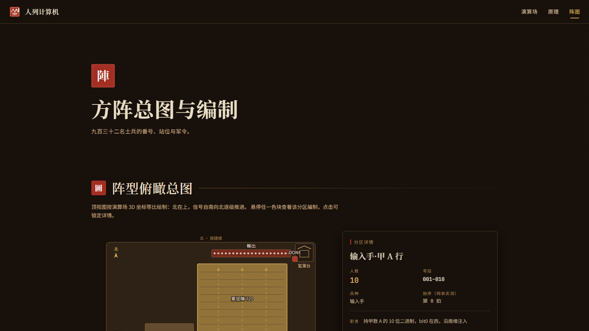

<p align="center">
  
</p>

<h1 align="center">人列计算机</h1>

<p align="center"><strong>三体 · 人列计算机 3D 模拟器</strong></p>

<p align="center">
  每位士兵是一扇逻辑门。红旗 = 1，蓝旗 = 0。<br/>
  鼓点一响，全阵同时翻旗，把 <code>(A + B) × C</code> 算完。
</p>

<p align="center">
  <a href="https://santi.ok.kimi.link"><strong>打开演算场</strong></a>
  ·
  <a href="https://suifei.github.io/santi-human-computer/">GitHub Pages</a>
  ·
  <a href="https://santi.ok.kimi.link/principle">原理</a>
  ·
  <a href="https://santi.ok.kimi.link/formation">阵图</a>
</p>

<p align="center">
  <strong>直接访问：<a href="https://santi.ok.kimi.link">https://santi.ok.kimi.link</a></strong><br/>
  <strong>GitHub Pages：<a href="https://suifei.github.io/santi-human-computer/">https://suifei.github.io/santi-human-computer/</a></strong>
</p>

<p align="center">
  
  
  
  
  
</p>


---

## 这是什么

《三体》里，秦始皇用三千万士兵组成人列计算机。这里把它缩成一座可点、可听、可算的操场：

- **932 名秦兵**，每人一张指令卡：门牌号、门型（AND / OR / XOR / NOT）、两名上游
- **真实门级网表**：10 位行波全加器 + 移位相加乘法器，默认演算 `(1013 + 1012) × 1001 = 2027025`
- **鼓点节拍**：一拍一层，可播放 / 暂停 / 单步 / 调速；连续三快拍复位全员蓝旗
- **点击士兵**弹出指令卡；相机可环绕、俯视、跟随信号

输入 A、B、C 各 0–1023。注入后击鼓，看红蓝旗从南往北翻到输出手。


推送到 `main` 会自动构建静态站点并发布到 GitHub Pages（与 kimi.link 同一份前端）。

## 三个入口

| 页面 | kimi.link | GitHub Pages |
| --- | --- | --- |
| 演算场 | https://santi.ok.kimi.link | https://suifei.github.io/santi-human-computer/ |
| 原理 | https://santi.ok.kimi.link/principle | https://suifei.github.io/santi-human-computer/principle |
| 阵图 | https://santi.ok.kimi.link/formation | https://suifei.github.io/santi-human-computer/formation |




## 演算场操作

| 操作 | 作用 |
| --- | --- |
| 左键拖拽 / 右键平移 / 滚轮 | 旋转、平移、缩放相机 |
| 点击士兵 | 查看指令卡（Esc 关闭） |
| `空格` | 击鼓 / 暂停 |
| `1`–`5` | 切换机位 |
| `F` | 跟随信号 |

横屏更好看。首次交互后才有鼓声。

## 本地运行

工程在 `app/`。需要 Node.js 18+。

```bash
cd app
npm install
npm run dev
```

浏览器打开 http://localhost:3000 （与线上同一套页面）。

```bash
npm run build      # 类型检查 + 生产构建
npm run preview    # 预览 dist
```

若 `npm install` 因锁文件里的旧镜像失败，用：

```bash
npm install --replace-registry-host=always --registry https://registry.npmmirror.com
```

## 电路怎么铺

信号南 → 北，按层传播。默认演示 `(A + B) × C`：

1. **输入手** 001–030：A / B / C 各 10 位，红蓝旗即二进制
2. **加法阵** 101–150：10 个全加器串进位，得到 S = A + B
3. **部分积阵** 201–310：`PP[j][i] = S[i] AND C[j]`
4. **累加阵**：9 条移位累加带，把部分积加总
5. **输出手** 901–921：21 位结果；DONE 旗举红即算完

全加器 5 门 4 层：`XOR1(A,B)`、`AND1(A,B)` → `XOR2`（和）/ `AND2` → `OR`（进位）。

网表在 `app/src/sim/netlist.ts`，与 DOM / Three 解耦，可用 `npm run verify:netlist` 对照 JS 原生 `(A+B)*C` 抽检。

## 技术栈

Vite 7 · React 19 · TypeScript · Three.js / React Three Fiber · Zustand · Tailwind

士兵用 InstancedMesh 画，932 人同一批绘制。GitHub Pages 由 `.github/workflows/deploy-pages.yml` 在每次 `main` 推送后自动发布。
