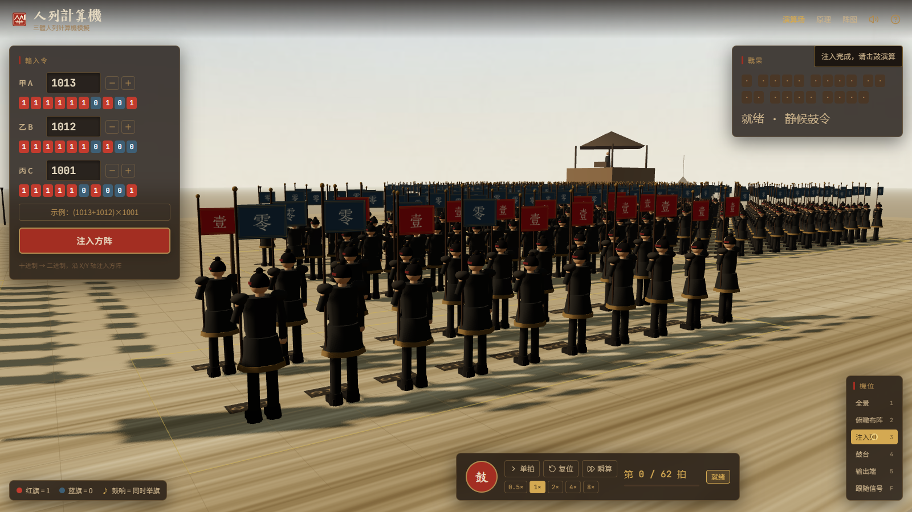
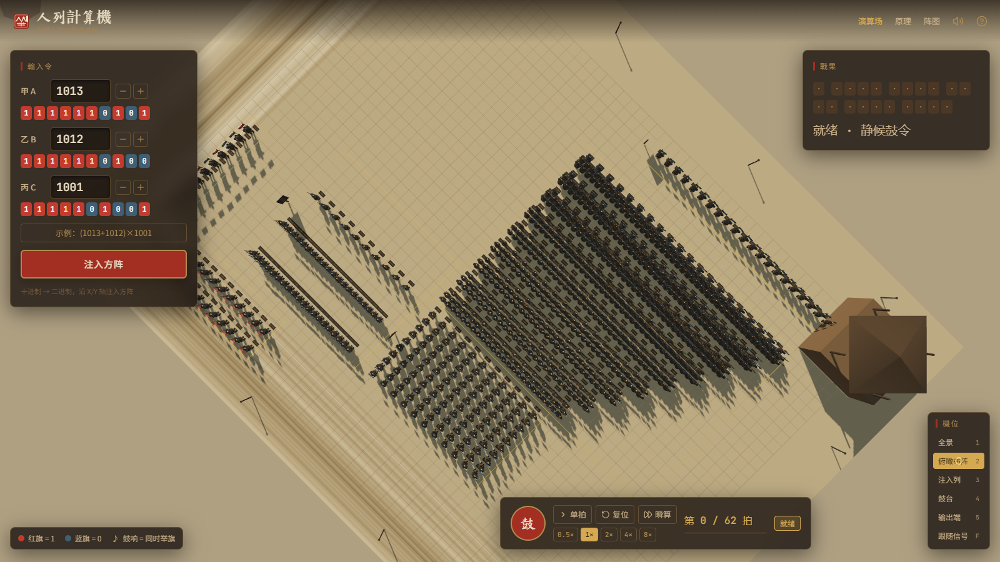
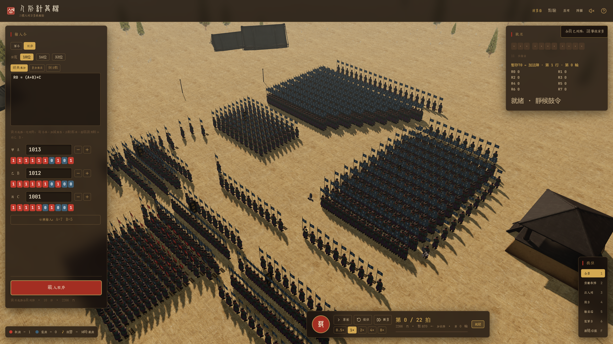
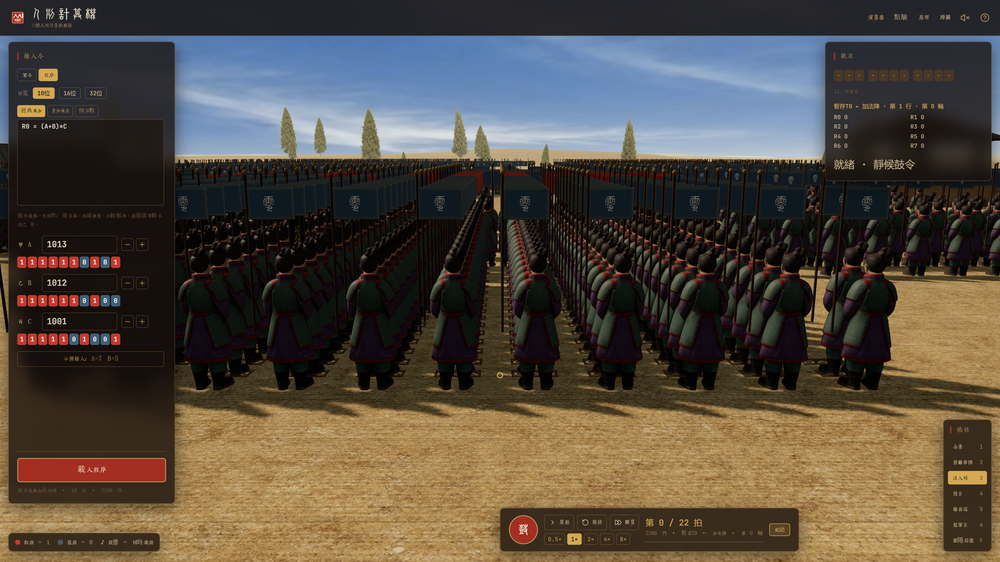

<p align="center">
  <br/>
  <sub>十位军令 · 九百三十二卒 · 鼓点翻旗</sub>
</p>

# 人列计算机

《三体》里，秦始皇用三千万士兵组成人列计算机。这里把它缩进浏览器：每位士兵是一扇逻辑门，红旗 = 1，蓝旗 = 0。鼓点一响，全阵同时翻旗，把 `(A + B) × C` 算完。

**Human-Array Computer**  
*Qin-dynasty soldiers as gates. Red flag = 1, blue flag = 0.*

In *The Three-Body Problem*, Qin Shi Huang builds a computer from thirty million soldiers. This shrinks that field into a browser: each soldier is a gate (AND / OR / XOR / NOT). A drumbeat, and the whole array flips at once.

- **Default campaign** — unsigned 10-bit `(A + B) × C`: **932 gates / 62 ticks / 21-bit output**. Example `(1013 + 1012) × 1001 = 2027025`. Widths 10 / 16 / 32; at most three binary ops; output ≤ 65 bits. Flags are live truth values, not a JavaScript result played back as animation.
- **Program mode** — one fixed CPU field (registers, add / sub / mul / div, and compare, all standing). Instructions activate units; they do not rebuild the army. 10-bit: **2266 gates**. `(A+B)*C` is add, then mul.
- **Live** — [open the yard](https://suifei.github.io/santi-human-computer/) · [v1.2](https://github.com/suifei/santi-human-computer/releases/tag/v1.2)

<p align="center">
  <a href="https://suifei.github.io/santi-human-computer/"><strong>打开演算场</strong></a>
  ·
  <a href="https://santi.ok.kimi.link">kimi.link</a>
  ·
  <a href="https://github.com/suifei/santi-human-computer/releases/tag/v1.2">v1.2</a>
  ·
  <a href="https://suifei.github.io/santi-human-computer/principle">原理</a>
  ·
  <a href="https://suifei.github.io/santi-human-computer/formation">阵图</a>
</p>

<p align="center">
  <a href="https://github.com/suifei/santi-human-computer/releases/tag/v1.2"></a>
  
  
  
</p>

标题「人列計算機」用说文解字小篆；界面与正文用黄令东齐伋体。士兵是逻辑门，旗帜是真值——没有「JS 先算完再回放」。

## 在线演示

| 页面 | GitHub Pages | kimi.link |
| --- | --- | --- |
| 演算场 | https://suifei.github.io/santi-human-computer/ | https://santi.ok.kimi.link |
| 原理 | https://suifei.github.io/santi-human-computer/principle | https://santi.ok.kimi.link/principle |
| 阵图 | https://suifei.github.io/santi-human-computer/formation | https://santi.ok.kimi.link/formation |

左键旋转、右键平移、滚轮缩放；点士兵看指令卡。`空格` 击鼓，`1`–`5` 换机位，`F` 跟随信号。横屏更好看。

## 默认军令

无符号 **10 位** `(A + B) × C`：**932 门 / 62 拍 / 21 位输出**。例 `(1013 + 1012) × 1001 = 2027025`。甲乙丙各 0–1023。注入后击鼓，红蓝旗从南往北翻到输出手。

位宽可选 10 / 16 / 32；军令最多 3 个二元运算，输出不超过 65 位。一条表达式铺一张专用网表（`A+B`、`A×B`、`(A+B)×C` …）。

信号南 → 北：输入手 001–030 → 加法阵 → 部分积 → 移位累加 → 输出手 901–921。DONE 旗举红即算完。



## 程序档

一张固定 CPU：寄存器、加减乘除、比较**同时列阵**。指令只激活对应部件，不按语句换整支军队。`(A+B)*C` 拆成微操作：先加再乘。10 位 **2266 门**；比较 / 加 / 减三列贴中，乘与除并排在南。

写赋值、`if`、`while`；值仍由士兵翻旗算出。循环请用较小的乙 B。





## 本地运行

工程在 `app/`。需要 Node.js 18+。

```bash
cd app
npm install
npm run dev
```

浏览器打开 http://localhost:3000（与线上同一套页面）。端口占用时可 `npm run dev -- --host --port 5175`。

```bash
npm run build      # 类型检查 + 生产构建
npm run preview    # 预览 dist
```

若 `npm install` 因锁文件里的旧镜像失败，用：

```bash
npm install --replace-registry-host=always --registry https://registry.npmmirror.com
```

网表在 `app/src/sim/netlist.ts`，与 DOM / Three 解耦。`npm run verify:netlist` 抽检默认编制；`npm run verify:program` 用同一张 CPU 网表抽检程序档。

## 版本

当前发布 [v1.2](https://github.com/suifei/santi-human-computer/releases/tag/v1.2)。推送到 `main` 会自动构建并发布到 GitHub Pages。

Vite 7 · React 19 · TypeScript · Three.js / React Three Fiber · Zustand · Tailwind。人与旗共用一套 InstancedMesh，下标即 `gate.index`。默认 932 人一批绘制；程序档 10 位 2266 人同样一批。
